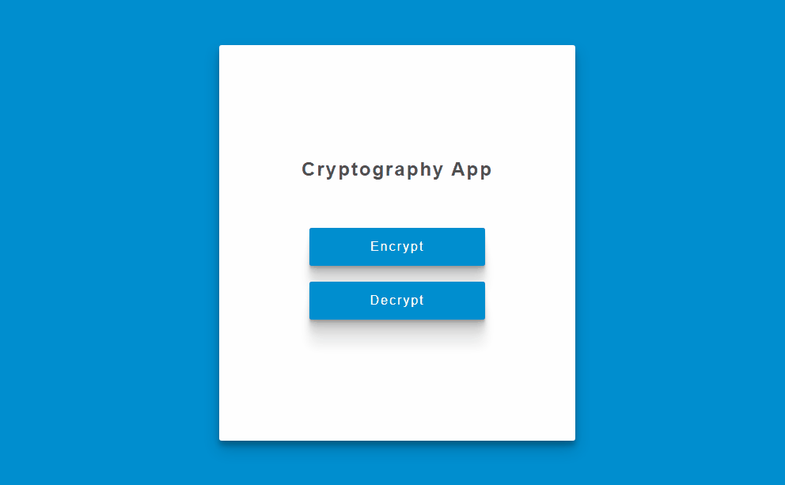

<h1 align="center">Cryptography App</h1>

This application performs text encryption using the xor algorithm

### Features

- [x] Encrypt text
- [x] Stores the encrypted text in the database 
- [x] Decrypt text

### 🛠 Tecnologias

- Javascript
- Jquery
- Firebase

<a href="https://andersonbones.github.io/cryptography-app/">DEMO 👽</a>
